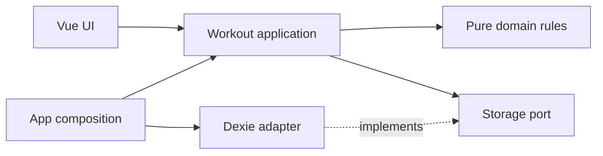

# Workout feature and dependency boundaries

The Workout Tracker groups training behavior in one workout feature. Sessions, routines, settings, history, and backups share the same snapshot and revision rules. A screen is not an independent storage boundary.

## Module ownership

The app lives in `apps/workout`. Its source has these responsibilities:

- `features/workouts/domain.ts` owns readonly models, Zod schemas, starter data, and the pure `reduceWorkout` transition. Time and ID generation are explicit inputs.
- `features/workouts/ports.ts` declares the storage contract using domain types. It imports no runtime implementation.
- `features/workouts/application.ts` owns commands, backup merging, revision checks, and the service lifetime. `createWorkouts` receives storage, a clock, and an ID generator.
- `features/workouts/adapters/dexie.ts` owns IndexedDB initialization, validation of persisted data, atomic writes, observation, and connection cleanup.
- `features/workouts/ui/` owns training-specific components and `useWorkouts`. The composable receives a service and removes its own subscription on disposal.
- `app/composition.ts` selects Dexie and the real clock and ID generator. `main.ts` creates one service, passes it to the app, and closes it when the app unmounts.

The existing IndexedDB name, schema version, `state` store, `snapshot` key, and backup format remain unchanged. No storage migration is needed.

Solid arrows show source dependencies. At runtime the application calls the injected adapter through the port.

## Public entry points

`features/workouts/index.ts` exports the domain and application API. `ui.ts` exports the components and composable. `infrastructure.ts` exports the adapter factory exclusively for the composition root.

Other features may import only the public index and only from their application layer. `featureDependencies` in `tooling/architecture/policy.mjs` declares permitted feature dependencies. It starts empty. Dependency cycles are rejected.

`packages/ui` owns generic components and design tokens. It has no workout, application, or persistence dependencies. Its public package exports remain `@form/ui` and `@form/ui/tokens.css`.

## Storage contract

`WorkoutStorage` provides `read`, `compareAndSave`, `subscribe`, and `close`. It exposes domain values and explicit results, not database clients, queries, or transaction callbacks.

`read` returns a ready snapshot, recoverable corrupt data, or an unavailable result. Corrupt data stays intact and can be exported. Initialization inserts starter data only when the snapshot does not exist.

`compareAndSave(expectedRevision, next)` validates and compares the current revision inside the same transaction as the write:

- A stale expected revision returns `conflict` with the current snapshot.
- A changed snapshot must advance the revision by exactly one.
- A snapshot with the same revision must have the same validated serialized content. It returns the persisted snapshot without a write.
- Invalid data and failed writes never report success.
- A closed handle rejects reads and writes. Closing one handle does not close another handle.

The application first reads the snapshot, rejects stale requests, and applies the domain transition. It then calls `compareAndSave`, including for no-op transitions. The second revision check catches writes that happened after the initial read. There are no automatic retries, so a conflict cannot silently regenerate IDs or overwrite another change.

The service owns its storage handle. Components own subscriptions only. Disposing a component does not close the service used by other components.

## Preserved behavior

There is one active workout. Session IDs also identify completed records, so finishing an already finished session is idempotent. Finishing an empty session is rejected. History and progress count completed sets only. Exercise details are immutable snapshots within each session.

Rest stores its deadline and source set. Reload and background throttling cannot extend the countdown.

Backups merge complete records atomically. Imports skip identical records, reject conflicting IDs, validate references, and preserve local settings. Imports cannot introduce two active sessions. A pristine installation can restore edited starter definitions. Imports advance the local revision rather than trusting the backup revision. Import is not device synchronization.

## Executable import rules

The Oxlint plugin and standalone checker share one policy in `tooling/architecture/policy.mjs`.

| Layer                | Allowed internal dependencies | Allowed external dependencies   |
| -------------------- | ----------------------------- | ------------------------------- |
| Domain               | Domain                        | Zod                             |
| Ports                | Domain types                  | None                            |
| Application          | Domain, ports, application    | Zod                             |
| Adapters             | Domain, ports, adapters       | Explicitly registered SDKs      |
| UI                   | Domain, application, UI       | Vue and registered UI libraries |
| Public index         | Domain, application           | None                            |
| Infrastructure entry | Adapters                      | None                            |

Dexie is registered only for `adapters/dexie.ts`. Future SDKs require an explicit adapter ownership rule. Concrete SDK types are not allowed in ports.

The policy resolves relative imports and configured TypeScript aliases. It checks type imports, re-exports, dynamic imports, and CommonJS imports. Nonliteral imports are rejected. The standalone check parses Vue script blocks and cannot be disabled with inline lint comments.

Domain, ports, and application code cannot read ambient network, storage, time, randomness, or browser state. Pass inputs or inject capabilities instead. Scope checks allow injected parameters with these names and ordinary object properties.

`pnpm lint` runs package boundaries, architecture rule tests, the standalone architecture check, and workspace Oxlint. Editor diagnostics provide early feedback. Required CI checks and repository branch protection must be configured on the hosting service to prevent merges after a failed check. The rules are architectural guardrails, not a sandbox for arbitrary JavaScript execution.

## Future adapters

A new storage adapter implements the same contract and runs the shared contract suite. The composition root selects it. Supabase, DynamoDB, authentication, and synchronization are not implemented by this refactor.

A remote database still needs a suitable data model and server-side authorization. Local-first synchronization needs its own conflict policy and workflow. An AI capability belongs behind a task-specific port with validated results; it does not bypass domain rules.

See [Testing responsibilities](testing.md) for verification of each boundary.
