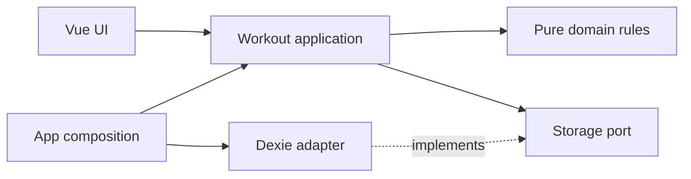

# Workout feature and dependency boundaries

The Workout Tracker groups training behavior in one workout feature. Sessions, routines, settings, history, and backups share the same snapshot and revision rules. A screen is not an independent storage boundary.

Domain terminology lives in [context](context.md); recurring implementation tasks are in [workflows](workflows.md).

## Workspace ownership

- `apps/workout` owns the PWA, workout feature, persistence, application layout, and isolated product-preview runtime.
- `packages/ui` owns generic Vue components, shared tokens, and the workout theme mapping. It has no workout-domain, persistence or translation dependencies; text arrives through props and slots.
- `packages/result` (`@form/result`) is a vendored copy of [better-result](https://github.com/dmmulroy/better-result): `Result`, `TaggedError` and `matchError`. It is plain ECMAScript with no dependencies, so the pure domain, ports and application layers may import it. Its README records the upstream version and our patches. ESLint and the lint scripts skip it, like the generated route map, because it is third-party code.
- `packages/composables` (`@form/composables`) owns small Vue composables adapted from [VueUse](https://github.com/vueuse/vueuse) (MIT): `useEventListener`, `useOnline`, `useMediaQuery`, `useDocumentVisibility` and `useLocalStorage`, plus the `readStorage` and `writeStorage` helpers that return `Result`s. Storage validation accepts any synchronous [Standard Schema](https://standardschema.dev), so the workout app passes Zod 4 schemas and the package has no validation dependency. It depends only on Vue and `@form/result`. Feature UI and application wiring (`usePwa`, `serviceWorkerUpdates`, `app/composition.ts`, the unsaved-changes warning) may import it; `packages/ui` and the domain, ports, application and adapters layers may not. `tooling/architecture/policy.mjs` rejects those feature imports and `scripts/check-boundaries.mjs` rejects the `packages/ui` dependency even when declared. Its tests are real-browser tests under `packages/composables/test`.
- `apps/design-system` owns the Histoire catalog, foundations, component examples, illustrative patterns and explorations. Its page and flow stories embed the workout-owned preview document through `ProductPreview.vue`; they do not import the workout application or service.

Applications consume the UI package; the UI package cannot depend on applications. Cross-workspace relative imports and private deep imports are forbidden. The UI package ships source compiled by its consumers, not a separately built distribution.

## Language and text ownership

All user-visible text lives in typed message catalogs in `apps/workout/src/i18n`: English (`en/<area>.ts`, the source of truth) and German (`de/<area>.ts`). Each file covers one screen area (`shell`, `workouts`, `exercises`, `progress`, `training`, `dialogs`, `settings`, `errors`, `common`) so it stays below the file-size limit. The `Catalog` type derives from the English text, so TypeScript rejects a German catalog with a missing or extra key, and `t("area.key", values, count)` accepts only catalog keys with the placeholders and plural count the English message needs. `test/unit/i18n.test.ts` additionally checks key, placeholder and plural-form parity.

The translator is a small custom module (`i18n/index.ts`) rather than vue-i18n. The library alone exceeded the JavaScript budget in `performance-budgets.json`; the app only needs `{name}` placeholders and `one | other` plural forms, which use the same syntax. The catalogs reach the browser as JSON, not as JavaScript. Together they are about 19 kB gzipped, and the JavaScript budget sums every script the build emits, so a lazily loaded script would not have helped. `catalogs.config.ts` is a Vite plugin that evaluates `src/i18n/en.ts` and `de.ts` at build time and emits one JSON asset per locale; the TypeScript files stay the typed source and are never imported at runtime (`i18n/index.ts` imports `en` as a type only). `virtual:i18n-catalogs` exports the file URLs, `i18n/catalogLoader.ts` fetches, shape-checks and registers a catalog (resolving `false` on any failure), and `i18n/loadCatalog.ts` wires it to `fetch`. `index.html` preloads the file for the starting language, the service worker precaches the JSON, and `main.ts` mounts only after the starting catalog is registered. Tests register the TypeScript catalogs through `i18n/testing.ts`. `createAppI18n(locale)` is a Vue plugin that provides the active locale; `useTranslation()` returns `t`, `useFormat()` returns number and date formatters built on `Intl` for that locale (`i18n/format.ts`).

- `apps/workout` owns the catalogs, the locale choice and `<html lang>`. The choice (`system`, `en` or `de`) is stored with `useLocalStorage` under `workout-language`, validated by a Zod schema. `system` follows the browser: the first browser language that has a catalog wins, otherwise English. `main.ts` resolves the initial locale and loads its catalog before mounting so the first paint is already in the right language (English when that fails, and an explanation in the startup shell when no catalog loads at all); `app/useLanguage.ts` loads the catalog of a newly chosen language before switching, keeps `<html lang>` in step with later changes and with other tabs, and shows a message in Settings, leaving the current language in place, when the file cannot be loaded.
- Feature UI (components and `ui/use*.ts` composables) is the only feature layer that may import `src/i18n`. Components call `useTranslation()`; composables receive `t: Translate` as an explicit parameter so unit tests pass a translator without mounting an app. Domain, ports, application and adapters stay free of text and `Intl`: they return stable codes (`RejectionCode`, tagged errors) and the UI maps each code to a message. `ui/errorMessages.ts` keeps the exhaustive `matchError` table, now producing text through `t`.
- `packages/ui` has no i18n dependency. Components that need text receive it through props or slots, and the app passes `t(...)` at the call site.
- Stored data stays language-neutral. Built-in exercise names, muscle groups and equipment are English values inside persisted snapshots and backups, so changing them would change stored data and IDs. Only the muscle-group and equipment labels are translated for display (`ui/exerciseLabels.ts`); built-in exercise names and user-typed names are shown as stored. Dates and numbers follow the active locale; weights stay in kilograms.
- `vue/no-bare-strings-in-template` is an error for `apps/workout/src/**/*.vue`, so a literal in a template or text attribute fails lint. Literals inside script expressions are reviewed by hand.

## Product preview boundary

Histoire displays the actual `App.vue`, route adapters, feature pages, styles and shared components through a separate workout-owned `preview.html` entry. Each application compiles its own source with its own toolchain. The document boundary isolates global styles, overlays, viewport media queries and navigation; no application-to-application source dependency is permitted.

`apps/workout/src/preview` owns named scenarios, valid seed snapshots, in-memory storage and drafts, and preview initialization. Every preview document creates its own service, memory-history router and advancing clock from a deterministic epoch. Reset recreates the document and all its sample state. The preview entry must not select browser persistence or register a service worker. Its lifetime includes service and clock cleanup. Production composition continues to supply real browser capabilities.

`apps/workout/src/preview/catalog.json` is the authoritative catalog of example IDs and descriptions. `scripts/design-workspace.mjs` synchronizes its checked-in mirror at `apps/design-system/src/preview-catalog.json` when starting or building Histoire. The mirror lets a fresh checkout discover and typecheck stories; edit the source catalog, not the mirror. Domain snapshots and runtime dependencies stay inside the workout workspace.

`ProductPreview.vue` embeds a selected example; its Controls panel owns reset outside the product viewport. Scenario loading validates the selected ID and seed data. Initial transient UI state belongs to narrow initialization inputs on its existing owner, rather than simulated clicks, copied page templates, or a second routing policy. Preview interactions execute the real workout commands against memory adapters. They demonstrate application behavior but provide no proof of IndexedDB, browser draft recovery, offline availability or installation.

The root `dev:ui` command starts Histoire on port 4186 and the workout preview server on strict port 4187. Histoire proxies `/product-preview` to the preview server. Its file-serving allow list includes the repository root so pnpm-linked shared assets, including fonts, load in development. Opening the preview server root or `index.html` redirects to `preview.html`, preserving scenario query parameters, so development never boots the production entry without its PWA plugin. A missing scenario opens the first-visit workout screen; an explicitly unknown scenario still reports an error. The coordinator owns both processes and stops them together. The root `build:ui` command builds the workout preview, copies it into the explorer's public assets and builds Histoire. The resulting `apps/design-system/.histoire/dist/product-preview` travels with the static explorer; it does not depend on a deployed workout app or a running preview server. The production workout build remains separate.

## Module ownership

The app lives in `apps/workout`. Its source has these responsibilities:

- `features/workouts/domain.ts` is the public domain API: readonly models, Zod schemas, starter data, and the pure `reduceWorkout` transition. It re-exports focused modules: `domain/schemas.ts` (models, snapshot validation and totals), `domain/commands.ts` (the command schema, `Inputs` and `Transition`), `domain/session.ts` (starter data, rest, phases and routine derivation), `domain/reducer.ts` (command entry and workout-level transitions) and `domain/activeReducer.ts` (transitions inside the active session, which receive an explicit `ReducerContext`). Import from `domain.ts`, not from these modules. Time and ID generation are explicit inputs. `workoutPhase` names the lifecycle (`idle`, `training`, `resting`) and `commandPhases` lists which phases accept each command; a unit test checks that table against `reduceWorkout`. Finishing an already completed session stays idempotent.
- `features/workouts/domain/errors.ts` defines one `TaggedError` class per expected failure (see [Expected failures](#expected-failures)); `domain/backup.ts` owns the backup file format, `parseBackup`, `serializeBackup`, the merge rules (`mergeSnapshots`) and the backup errors; `domain/loadState.ts` turns a read result into the `LoadState` the interface shows.
- `features/workouts/ports.ts` declares the storage and draft journal contracts using domain types. It imports no runtime implementation.
- `features/workouts/application.ts` owns commands, revision checks, and the service lifetime. `createWorkouts` receives storage, the draft journal, a clock, and an ID generator. Its `deleteAllData` capability owns revision-checked reset and draft erasure, including a `DraftCleanupPending` partial-cleanup failure.
- `features/workouts/domain/drafts.ts` owns draft values and their validation; `features/workouts/adapters/browser-drafts.ts` implements the injected draft journal using browser storage.
- `features/workouts/adapters/dexie.ts` owns IndexedDB initialization, validation of persisted data, atomic writes, observation, and connection cleanup.
- `features/workouts/ui/` owns training-specific components and `useWorkouts`. The composable receives a service and removes its own subscription on disposal. `ui/errorMessages.ts` owns the text of every expected failure.
- `app/composition.ts` selects Dexie and the real clock and ID generator. `main.ts` creates one service, passes it to the app, and closes it when the app unmounts.

The IndexedDB name, table version, `state` store, and `snapshot` key remain unchanged. Templates now contain per-set targets. Backups use version 2. Legacy snapshots and version 1 backups are not migrated.

Solid arrows show source dependencies. At runtime the application calls the injected adapter through the port.

## Page ownership and controller lifetime

The workout pages remain inside the workout feature. Workouts, templates, training, the exercise catalog, and progress are views of the same snapshot, not independent persistence boundaries.

`App.vue` owns the application shell and receives runtime capabilities from its composition. `app/router.ts` creates Vue Router 5 navigation using an injected history; production uses hash history with the deployment base path and product previews use memory history. The generated routes in `pages/` are application adapters that import feature pages through `features/workouts/ui.ts`. They share the shell-owned workspace and dialogs through `app/workoutRouteContext.ts`; they do not create controllers. Feature pages receive the data they display and emit user actions. Calendar, history filtering, and chart projections belong with their pages. Shared formatting stays in the feature UI.

`WorkoutsPage`, `ExercisesPage`, `TrainingPage`, and `ProgressPage` own the main page templates. Home and full History are separate views in WorkoutsPage. `TrainingDock` owns the mobile training controls. `WorkoutDialogs` hosts every workout sheet and routes requests between them; it owns finish and confirmation state and completed-session selection. `WorkoutDialogsTemplates` owns template browsing in the same sheet as routine editing, including its conflict choice and focus return. `WorkoutDialogsExercisePicker` owns exercise selection and custom-exercise creation. `WorkoutDialogsSetOptions`, `WorkoutDialogsFinish` and `WorkoutDialogsCompletedDetail` receive the values they show and emit intents. `WorkoutSettings` owns the Settings page body, preferences, and backup controls. `pages/SettingsRoute.vue` exposes it at `/settings` and composes its Appearance and installation sections through the existing slot. `app/appearance.ts` owns the theme and accent choice: it reads and saves `localStorage`, sets `data-theme` and `data-accent` on `<html>`, follows the system color scheme and is provided to `AppearanceSettings.vue` by `main.ts` and the preview entry. `index.html` and `preview.html` apply the saved choice with an inline script before first paint; a unit test keeps its keys in step with `appearance.ts`.

`App.vue` calls `useWorkoutWorkspace` once to create `useWorkouts`, `useTrainingSession`, and the shared clock. Page navigation does not recreate either composable. This preserves the shared saving lock, selected set, live draft baselines, and last-log undo. The training page and mobile controls use that same training instance. Inline set rows, explicit clearing and atomic exercise configuration reuse its draft and revision guards. Detailed set operations remain in a correction sheet. The dock derives its next set from canonical exercise/set order.

The Workouts URL owns the typed `home | history | templates` view. The experimental resolver parses `?view=` through a Zod enum; missing or invalid values default to Home. Global Workouts navigation, finishing and discarding return to Home. User drilldowns push history entries; explicit template dismissal and post-save landing replace the entry. History transitions reset scroll and focus the main content. Template navigation leaves focus with the existing dialog owner. Home remains mounted underneath Templates so its opener survives. `WorkoutDialogs` derives its template sheet from route browsing or an open editor; browser Back requests the existing dirty-editor confirmation without unmounting the draft. Root, legacy `/today` and `/history`, and unknown paths redirect to Workouts.

`useWorkouts` keeps one `SaveNotice` union (`none`, `saved`, `failed`) behind its `message` and `error` refs, so a save confirmation and an error are never shown together; each new action replaces the previous outcome. Only failures that a reload can resolve (conflicts, unavailable storage, thrown saves and navigation errors) offer Reload. `saving` stays a separate in-flight lock. Navigation errors appear through the workspace error notice. Shell links and feature navigation clear an old status synchronously when changing pages; completion never clears a newly saved status or steals dialog focus. Browser back/forward retains status until another action. Shell links, and page links routed through `useLinkNavigation` (the active workout's Workouts back link), focus the main region after navigation only if focus is still on the initiating link or was lost to the document body because that link unmounted. The skip link focuses main without changing the hash URL.

Progress selection and cross-page dialog state also survive page navigation. Template editing retains its accepted template baseline. An explicit save uses the latest observed revision only when that target still matches the baseline; actual template changes require an explicit conflict choice. Atomic storage comparison still rejects races after that check, without an automatic retry. Backup import retains the revision captured when the file is read. Its pending file selection is local to the Settings page and is cleared when the page unmounts. Completing a workout opens its detail after returning to the workout overview.

Finish confirmation captures the active session identity when opened and closes when that identity changes. Its submit handler checks the captured identity independently. `useWorkoutName` separates active input from detached name recovery by session ID. The shell keeps recovery accessible after the training page closes. The explicit completed-name recovery command and atomic completed-correction command update only an existing completed workout through the same revision-checked application boundary. The completed-workout editor owns separate raw input and its opening revision; it never uses the active training journal. The correction command permits only the name and logged set weight/repetitions, preserving identity, dates, targets and unrelated active state. Failed or stale saves retain local input until explicit dismissal or reload. Native browser exit protection observes each editor's dirty state and removes its listener when clean or disposed.

Production composition supplies PWA capabilities to `App.vue`. `usePwa` builds on the shared composables: `useOnline` for connectivity, `useMediaQuery` for standalone display mode and `useEventListener` for the install events; `watchServiceWorkerUpdates` follows `useDocumentVisibility` and `useOnline` inside its own effect scope. Their listeners are removed when the owning scope is disposed. `app/composition.ts` reads and writes the draft journal's per-tab writer pointer with `readStorage` and `writeStorage`, so the value is stored as JSON; the draft journal itself keeps its multi-writer logic in `adapters/browser-drafts.ts`. The Settings route receives readonly installation state and an install action through `app/workoutRouteContext.ts`. The route owns the installation entry point. The shell opens a shared installation sheet; `usePwa` (`apps/workout/src/usePwa.ts`) owns native prompt availability, platform detection, standalone-mode listeners and installer result state. `BaseInstallInstructions` (`packages/ui/src/BaseInstallInstructions.vue`) receives presentation props and emits intent without browser access, so the workout feature does not depend on PWA infrastructure. It cannot import application wiring or select a storage adapter. The existing architecture checks enforce this boundary.

### Error boundary

`main.ts` renders `App` inside `app/AppErrorBoundary.vue`. When a descendant throws while rendering, in a lifecycle hook or in an event handler, the boundary replaces the interface with a recovery screen: focus moves to its heading, Reload app reloads the page, and Copy diagnostics copies fixed text (app name, `APP_VERSION` and a generic failure label). The exception, its stack and anything from the workout journal are never copied or shown. Reloading is the only recovery. Confirmed workouts are untouched in IndexedDB, and unlogged weight and repetitions are still in the draft journal, but the recovery screen cannot promise them: the page that failed may have held newer input, and a failure while recovering drafts would fail again. Unsaved name, note and template editors are lost. The boundary does not catch rejected promises outside Vue's handlers. `APP_VERSION` is defined at build time from `VITE_APP_VERSION` (default `development`) by `vite.config.ts` and `vitest.config.ts`, and the production page also carries it as a `build-version` meta tag.

### Service worker updates and tabs

The service worker is registered with `registerType: "prompt"`, `skipWaiting: false` and `clientsClaim`. A new worker waits until a tab sends `SKIP_WAITING`, which only the Update app button does, and the shell withholds that button while a workout is active.

`usePwa` wraps `useRegisterSW` from vite-plugin-pwa. Left alone, the generated registration code (`virtual:pwa-register`, `register.js` in `vite-plugin-pwa/dist/client/build`) adds a `controlling` listener that calls `window.location.reload()` in every tab that has seen the waiting worker, so accepting the update in one tab reloaded all the others. `usePwa` passes `onNeedReload`, which replaces that reload. The tab whose user pressed Update app (`updateAccepted`) reloads. Any other tab only sets `reloadReady`, and `App.vue` shows "Updated — reload when ready." with a Reload app button, hidden while a workout is active like the Update app notice. No tab reloads unless its own user chose it, so unsaved name, note and template editors and unlogged drafts are never lost to another tab's choice.

The new worker removes the precache entries of the old build when it activates (`cleanupOutdatedCaches` only drops caches of older precache formats; the entry cleanup is Workbox precaching itself). A tab still running the old build can then no longer fetch a lazy route chunk it has not loaded yet: the request misses the cache, the server has no file with that hash, and the router reports a failed navigation. The shell shows its normal "This page could not be opened" notice with Reload, beside the reload notice. Already loaded screens keep working. [Verification](verification.md#service-worker-updates) records which of these behaviors the update journeys check.

## Public entry points

`features/workouts/index.ts` exports the domain and application API. `ui.ts` exports the components and composable. `infrastructure.ts` exports the adapter factory exclusively for the composition root.

Other features may import only the public index and only from their application layer. `featureDependencies` in `tooling/architecture/policy.mjs` declares permitted feature dependencies. It starts empty. Dependency cycles are rejected.

`packages/ui` owns generic components and design tokens. It has no workout, application, or persistence dependencies. Its public package exports are `@form/ui`, `@form/ui/tokens.css`, `@form/ui/styles.css`, `@form/ui/workout-theme.css`, and the type-only `@form/ui/muscle-map-types`. Palette values live in `tokens.css` as `light-dark()` pairs with per-accent blocks; `workout-theme.css` maps those values to generic component roles for both applications. `styles.css` imports the Geist font, so the package needs no font setup from its consumers.

## Storage contract

`WorkoutStorage` provides `read`, `compareAndSave`, `subscribe`, and `close`. It exposes domain values and `Result`s, not database clients, queries, or transaction callbacks.

`read` returns `Result<Snapshot, ReadError>`. The error is `StorageUnavailable`, `StorageClosed`, or `StoredDataUnreadable`, which carries a raw export of corrupt data. Corrupt data stays intact and can be exported. Initialization inserts starter data when the snapshot does not exist. When a valid snapshot lacks a built-in exercise from the current starter data, initialization adds it and advances the revision by one, so an expected revision captured before the first read can become stale without a write from that tab. A failed initialization is not cached: the next read or write opens the database again. `subscribe` reports a `LoadState` (`loading`, `ready`, or `failed` with the same `ReadError`).

`compareAndSave(expectedRevision, next)` returns `Result<Snapshot, SaveError>`. It validates and compares the current revision inside the same transaction as the write:

- A stale expected revision fails with `Conflict`, which carries the current snapshot.
- A changed snapshot must advance the revision by exactly one.
- A snapshot with the same revision must have the same validated serialized content. It returns the persisted snapshot without a write.
- Invalid data (`InvalidChange`), a malformed revision (`InvalidRevision`), unreadable stored data (`RecoveryRequired`) and failed writes never report success.
- A closed handle fails with `StorageClosed` on reads and writes. Closing one handle does not close another handle.

`apps/workout/test/support/storage-contract.ts` states these rules once. It runs against the in-memory storage in unit tests and against Dexie in browser tests. Unit tests and product previews share the single in-memory implementation in `src/preview/memoryPorts.ts`, so orchestration tests cannot rely on writes that a real adapter rejects.

The application first reads the snapshot, rejects stale requests, and applies the domain transition. It then calls `compareAndSave`, including for no-op transitions. The second revision check catches writes that happened after the initial read. There are no automatic retries, so a conflict cannot silently regenerate IDs or overwrite another change.

The read, the domain transition and the write fail separately. An exception from the transition is a programming error and fails with `InvalidChange` without touching storage. A write that throws may still have committed, so the application reads again: the expected revision means nothing was written and the failure is `StorageUnavailable`; matching content means the write landed and the result is the saved snapshot; any other snapshot is a `Conflict`. If that read also fails, the failure is `SaveUnconfirmed`, which asks the user to reload before trying again. `code-policy/one-effect-per-try` keeps each awaited effect in the application and adapters in its own `try`; `Result.tryPromise` wraps one effect each.

The service owns its storage handle. Components own subscriptions only. Disposing a component does not close the service used by other components.

## Expected failures

Expected failures are return values. The storage port, the application commands (`execute`, `importBackup`, `exportBackup`, `deleteAllData`) and the draft journal return `Result<T, E>` from `@form/result`; programmer errors and violated invariants (a missing route context, an unknown preview scenario) still throw. Each failure is one `TaggedError` class in `domain/errors.ts` or `domain/backup.ts`. `Result.gen` composes the steps of a command in order and stops at the first failure; `Result.tryPromise` and `Result.try` turn one thrown browser or IndexedDB exception into a typed error at the adapter and application boundary.

| Vocabulary | Errors |
| --- | --- |
| saved | the `Ok` snapshot |
| conflict | `Conflict` (carries the current snapshot) |
| invalid | `InvalidChange`, `InvalidRevision`, `RecoveryRequired`, and the backup errors `BackupTooLarge`, `BackupUnreadable`, `InvalidBackup`, `ConflictingRecord`, `ActiveWorkoutInProgress`, `ActiveWorkoutFinished` |
| unavailable | `StorageUnavailable`, `StorageClosed`, `SaveUnconfirmed` |

`DraftCleanupPending` (a deletion that committed while draft cleanup failed) and the draft journal's `DraftsDeleted` and `DraftStorageFailed` complete the set. The workspace layer keeps `Snapshot | null` for its own callers: `useWorkouts.run` turns a failed `Result` into a notice and adopts the snapshot a `Conflict` carries.

`ui/errorMessages.ts` maps every error to its message and to whether Reload can resolve it with `matchError`. The handler table is exhaustive, so adding an error class without a message does not type-check. Messages with data, such as `InvalidChange`, carry their text in the error; fixed texts live only in this table.

## Preserved behavior

There is one active workout. Session IDs also identify completed records, so finishing an already finished session is idempotent. Finishing an empty session is rejected. History and progress count completed sets only. Exercise details are immutable snapshots within each session.

Rest stores its deadline and source set. Reload and background throttling cannot extend the countdown.

Backups merge complete records atomically. Imports skip identical records, reject conflicting IDs, validate references, and preserve local settings. Imports cannot introduce two active sessions. A pristine installation can restore edited starter definitions. Imports advance the local revision rather than trusting the backup revision. Import is not device synchronization.

## Executable import rules

The Oxlint plugin and standalone checker share one policy in `tooling/architecture/policy.mjs`.

| Layer                | Allowed internal dependencies | Allowed external dependencies   |
| -------------------- | ----------------------------- | ------------------------------- |
| Domain               | Domain                        | Zod, `@form/result`             |
| Ports                | Domain types                  | `@form/result` types            |
| Application          | Domain, ports, application    | Zod, `@form/result`             |
| Adapters             | Domain, ports, adapters       | `@form/result`, explicitly registered SDKs |
| UI                   | Domain, application, UI       | Vue, `@form/result`, `@form/composables` and registered UI libraries |
| Public index         | Domain, application           | None                            |
| Infrastructure entry | Adapters                      | None                            |

Dexie is registered only for `adapters/dexie.ts`. Future SDKs require an explicit adapter ownership rule. Concrete SDK types are not allowed in ports.

The policy resolves relative imports and configured TypeScript aliases. It checks type imports, re-exports, dynamic imports, and CommonJS imports. Nonliteral imports are rejected. The standalone check parses Vue script blocks and cannot be disabled with inline lint comments.

Domain, ports, and application code cannot read ambient network, storage, time, randomness, locale, logging, or browser state. Pass inputs or inject capabilities instead. Two checks enforce this. `tsconfig.pure.json` compiles those files with only the ECMAScript library, so browser and DOM names do not type-check; `pnpm typecheck` runs it first. The architecture rule allows only ECMAScript built-ins as undeclared globals in those layers; `Intl`, timers, `console`, `location` and every other host global are rejected. `new Date(value)` with an argument and `Math` functions other than `random` remain allowed. Scope checks allow injected parameters with these names and ordinary object properties.

`pnpm lint` runs workspace Oxlint, including its architecture rules, followed by ESLint for Vue templates and CSS. `code-policy/workspace-imports` reuses the workspace import policy for source imports, while ESLint checks CSS imports, including Vue style blocks. Source imports therefore enforce public exports, declared dependencies, and cross-workspace direction during normal linting. The standalone package and architecture checks (`pnpm check:boundaries`, `pnpm check:architecture`) run as the last stages of `pnpm lint`. Editor diagnostics provide early feedback. Required CI checks and repository branch protection must be configured on the hosting service to prevent merges after a failed check. The rules are architectural guardrails, not a sandbox for arbitrary JavaScript execution.

## Future adapters

A new storage adapter implements the same contract. The composition root selects it. Supabase, DynamoDB, authentication, and synchronization are not implemented by this refactor.

A remote database still needs a suitable data model and server-side authorization. Local-first synchronization needs its own conflict policy and workflow. An AI capability belongs behind a task-specific port with validated results; it does not bypass domain rules.

## Training drafts

Unconfirmed weight and repetition strings live in a separate synchronous browser draft journal. Confirmed snapshots and totals remain separate from raw drafts. Composition injects the journal; its adapter validates bounded records at the storage boundary. Each edit gets an immutable ID and each writer removes only its own previous edit. Before a set commit, the controller recovers unseen records and requires review. A successful commit acknowledges only the reviewed draft IDs captured before awaiting the command, so a later edit from another tab survives.

The session controller (`useTrainingSession`) owns command execution, notices and last-log undo. It composes `useTrainingDrafts`, which owns one editable row per set and every journal effect (sync, persist, recovery of unseen records, acknowledgement), and `useTrainingSelection`, which owns the current exercise, selected set and review focus. Pure rules in `domain/trainingDrafts.ts` decide recovered input, conflicts, logging versus saving, undo eligibility, values for an added set, and the repetitions logged by the circle shortcut. `draftStatus` is the only interpreter of the stored row flags and reports `saved`, `editing` or `conflict` with a reason. Named transitions (`editDraft`, `resetDraftToSaved`, `keepDraftInput`, `chooseRecoveredDraft`, `observeSavedSet`, `mergeUnseenDrafts`) are the only writers of those flags; the controller applies their patches. Undoing the last log uses the same guard as undoing a specific set, so neither runs while that set has pending input. `domain/routineDrafts.ts` validates template editor values independently of Vue. Application create commands allocate persistent exercise and template IDs through the injected identity source after the revision check. UI-only list keys remain local to the editor. The composition root owns the browser clock and passes its current-time ref to workspace projections. Row buttons submit their native set form. The mobile training bar and the training page read one workspace `trainingMode` (`resting`, `next`, `all-logged`, `empty`) and one `canFinish` presentation gate, so their rest, next-set and finish states cannot diverge. Drafts recover after navigation, reload and reopening. A changed canonical baseline blocks submission until the user explicitly keeps their input or adopts the saved values. Recovered drafts with a different revision also require explicit resolution, even if the values have returned to their original state. This conservative check avoids replaying stale intent after another tab completes and undoes a set. Live input can still follow unrelated canonical saves when its target baseline is unchanged.

Obsolete records are pruned only when their source revision is older than the observed canonical snapshot and their session or set is absent. A stale observer cannot prune a draft from a newer revision. Drafts for a set of a finished workout are never pruned: `prune` returns them instead. Such a draft arrived after the finish observed the journal, for example from another tab while the finish was committing, or it is a tab's own pending input when another tab finished. `useDetachedDrafts` acknowledges those whose values already match the finished set and keeps the others as detached input. The workspace reports them through the shared error notice once no save is running, naming each set and its values, and `training.dismissDetached` acknowledges them. Until then they survive reloads and are reported again on the next load.

Every journal operation returns a `Result`. A write refused because of a newer data deletion fails with `DraftsDeleted`; the row asks for a reload instead of a retry. Any other browser storage failure is `DraftStorageFailed`, which carries its cause. When a write succeeds but superseded records cannot be cleared, the row keeps those records for the next acknowledgement and reports only the cleanup failure. Records of a removed row that cannot be acknowledged are retried on the next snapshot, and the training notice reports the first failure.

Draft recovery can fail independently from confirmed IndexedDB storage. The app keeps the entered text visible and reports that closing the page may lose it. Acknowledgement failures remain visible; recovered stale input cannot silently overwrite newer work. Backups contain confirmed workout data, not raw drafts.

## Active workout integration

The workspace owns one `useWorkoutName` draft shared by the page, mobile dock and finish dialog. Its saved-name baseline and revision preserve conflict choices; every finish entry uses the same dirty state. The page and exercise editor expose leave decisions to `SessionRoute`, which owns the router guard. `useLeaveConfirmation` owns each pending discard decision for the training page name, the exercise editor and the completed-workout editor: concurrent requests share one answer, and resetting or disposing the owner answers "stay", so a router guard never waits on a dialog that is gone. Template editors own their normalized persisted-field baseline and dismissal guard.

Finish safety is enforced below individual controls. `useWorkoutWorkspace.run` routes finish commands through the training controller's numeric-draft and journal checks; the injected executor also rejects finishes while the shared workout name is dirty. Both command entry points retain an explicitly supplied revision. Backup import and data deletion run through workspace commands that take the shared saving lock and adopt the snapshot they report; the raw service exposes only backup export. The workspace exposes its load state, saving flag and notices as read-only refs. Components change them only through `notify`, `clearMessage`, `clearError`, `fail` and the training controller's `announce`, so every save keeps the shared lock and finish checks. `code-policy/no-prop-ref-writes` rejects assignments through props or values destructured from them. Disabled buttons remain presentation feedback, not the enforcement boundary.

`TrainingPage` composes the canonical exercise thumbnail strip and selected exercise, using the shell-owned `currentExercise` and `selectExercise`. Existing `TrainingRow` values drive inline `SetRow` controls without a second editable model. The page owns correction focus and temporarily unmounts inline rows while the detailed editor is open. `ExerciseConfiguration` owns a single options sheet with mutually exclusive action, configuration, note, and replacement views. Each focused edit captures its opening revision. `useTrainingSession.editExercise` guards structural edits against numeric drafts and submits the revision-checked command. Note saves skip numeric-draft inspection. The domain applies replacement in one transition, retaining logged attribution and creating fresh identities for remaining work. Optional target replacements change only unfinished work. `TrainingSetEditor` uses the existing recoverable set rows. Completion does not reorder the strip or change the selected exercise.

The set schema accepts optional `targetReps` for compatibility with existing version 2 snapshots and backups. Reads preserve absent fields rather than rewriting old records. New set edits capture positive targets; actual logged repetitions may be zero. Old app versions with the previous strict schema may reject new enriched backups. The database name and table version are unchanged.

Optional session-exercise notes keep existing version 2 snapshots and backups readable without a database migration. New exports include saved notes. Older strict-schema clients can reject note-bearing snapshots or backups.

### Data deletion across stores

`deleteAllData` writes a default snapshot with an increased revision through the existing atomic comparison. Only a successful reset can erase drafts. The browser draft adapter keeps one revision marker, `form-workout:drafts-deleted-before`, raised in place, and removes older app-owned draft records, including malformed records. It still honors the per-deletion `form-workout:drafts-deleted-before:<revision>` keys written by earlier versions and removes them once the single marker covers them. Malformed marker values are ignored rather than blocking writes. Draft writers check the maximum deletion revision before and after writing, and recovery ignores older records. Unrelated browser keys and newer drafts remain untouched. IndexedDB and localStorage are separate resources; cleanup failure is a visible partial result, not an atomic rollback guarantee.

### Selected-workout creation and history reference

`WorkoutDialogs` keeps a temporary start/add picker intent. Add captures its session identity. The domain `start-selected` command resolves selected catalog IDs, constructs default sets and starts the full workout in the existing atomic application save. Template-only `start` requires a template ID. The dialog closes only after success; it does not orchestrate separate start and add writes. No setup draft or persisted schema was added.

`domain/exerciseHistory.ts` selects the latest completed workout with logged sets for a catalog identity. `TrainingPage` presents that reference and owns the rename sheet; `useWorkoutName` continues to own dirty input, revision and conflict handling. Finish still passes through the workspace draft guards.

## Exercise catalog presentation

`ui/ExerciseCatalog.vue` owns transient search, filters and alphabetical ordering while callers own selected IDs and all commands. Its pure `catalogFilters.ts` projection intersects search with equipment, category and custom-only fields without mutating catalog data. `ExerciseFilterSheet.vue` owns one nested sheet and its overview/equipment/muscle navigation and focus transitions. `catalogIllustrations.ts` holds explicit equipment artwork and broad group illustrations using public UI types. None of this state is persisted or added to backups.

The catalog retains fragment roots so its list remains a direct child of picker sheets. The sheet layout reserves space for the caller's sticky Start/Add action and scrolls only the list. Filtering never removes IDs from the caller's selection.
