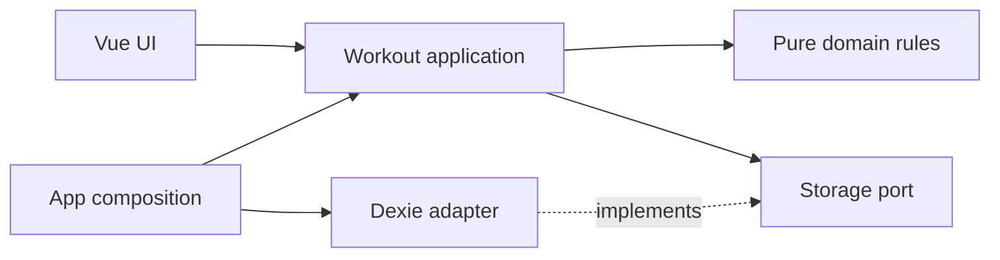

# Workout feature and dependency boundaries

The Workout Tracker groups training behavior in one workout feature. Sessions, routines, settings, history, and backups share the same snapshot and revision rules. A screen is not an independent storage boundary.

Domain terminology lives in [context](context.md); recurring implementation tasks are in [workflows](workflows.md).

## Workspace ownership

- `apps/workout` owns the PWA, workout feature, persistence, and application layout.
- `packages/ui` owns generic Vue components, shared tokens, and the workout theme mapping. It has no workout-domain or persistence dependencies.
- `apps/design-system` owns Histoire foundations, component examples, and illustrative patterns. It imports public UI exports and uses isolated story state rather than the workout service.

Applications consume the UI package; the UI package cannot depend on applications. Cross-workspace relative imports and private deep imports are forbidden. The UI package ships source compiled by its consumers, not a separately built distribution.

## Module ownership

The app lives in `apps/workout`. Its source has these responsibilities:

- `features/workouts/domain.ts` owns readonly models, Zod schemas, starter data, and the pure `reduceWorkout` transition. Time and ID generation are explicit inputs.
- `features/workouts/ports.ts` declares the storage contract using domain types. It imports no runtime implementation.
- `features/workouts/application.ts` owns commands, backup merging, revision checks, and the service lifetime. `createWorkouts` receives storage, a clock, and an ID generator.
- `features/workouts/domain/drafts.ts` owns draft values and their validation; `features/workouts/adapters/browser-drafts.ts` implements the injected draft journal using browser storage.
- `features/workouts/adapters/dexie.ts` owns IndexedDB initialization, validation of persisted data, atomic writes, observation, and connection cleanup.
- `features/workouts/ui/` owns training-specific components and `useWorkouts`. The composable receives a service and removes its own subscription on disposal.
- `app/composition.ts` selects Dexie and the real clock and ID generator. `main.ts` creates one service, passes it to the app, and closes it when the app unmounts.

The IndexedDB name, table version, `state` store, and `snapshot` key remain unchanged. Templates now contain per-set targets. Backups use version 2. Legacy snapshots and version 1 backups are not migrated.

Solid arrows show source dependencies. At runtime the application calls the injected adapter through the port.

## Page ownership and controller lifetime

The workout pages remain inside the workout feature. Workouts, templates, training, the exercise catalog, and progress are views of the same snapshot, not independent persistence boundaries.

`App.vue` owns the application shell, hash navigation, and PWA integration. Feature pages receive the data they display and emit user actions. Calendar, history filtering, and chart projections belong with their pages. Shared formatting stays in the feature UI.

`WorkoutsPage`, `ExercisesPage`, `TrainingPage`, and `ProgressPage` own the main page templates. History is part of the workout overview. `TrainingDock` owns the mobile training controls. `WorkoutDialogs` owns routine editing, exercise selection, set options, confirmations, and completed-session details. `WorkoutSettings` owns preferences and backup controls.

`App.vue` calls `useWorkoutWorkspace` once to create `useWorkouts`, `useTrainingSession`, and the shared clock. Page navigation does not recreate either composable. This preserves the shared saving lock, selected set, live draft baselines, and last-log undo. The training page and mobile controls use that same training instance. Circle logging, explicit clearing and atomic exercise configuration reuse its draft and revision guards. Detailed set forms remain in a persistent correction sheet. The dock derives its next set from canonical exercise/set order.

Progress selection and cross-page dialog state also survive page navigation. Routine editing retains the revision captured when the editor opens. Backup import retains the revision captured when the file is read. Completing a workout opens its detail after returning to the workout overview.

The feature UI receives PWA capabilities from the application shell. It cannot import application wiring or select a storage adapter. The existing architecture checks enforce this boundary.

## Public entry points

`features/workouts/index.ts` exports the domain and application API. `ui.ts` exports the components and composable. `infrastructure.ts` exports the adapter factory exclusively for the composition root.

Other features may import only the public index and only from their application layer. `featureDependencies` in `tooling/architecture/policy.mjs` declares permitted feature dependencies. It starts empty. Dependency cycles are rejected.

`packages/ui` owns generic components and design tokens. It has no workout, application, or persistence dependencies. Its public package exports are `@form/ui`, `@form/ui/tokens.css`, `@form/ui/styles.css`, and `@form/ui/workout-theme.css`. Palette values live in `tokens.css`; `workout-theme.css` maps those values to generic component roles for both applications.

## Storage contract

`WorkoutStorage` provides `read`, `compareAndSave`, `subscribe`, and `close`. It exposes domain values and explicit results, not database clients, queries, or transaction callbacks.

`read` returns a ready snapshot, recoverable corrupt data, or an unavailable result. Corrupt data stays intact and can be exported. Initialization inserts starter data only when the snapshot does not exist.

`compareAndSave(expectedRevision, next)` validates and compares the current revision inside the same transaction as the write:

- A stale expected revision returns `conflict` with the current snapshot.
- A changed snapshot must advance the revision by exactly one.
- A snapshot with the same revision must have the same validated serialized content. It returns the persisted snapshot without a write.
- Invalid data and failed writes never report success.
- A closed handle rejects reads and writes. Closing one handle does not close another handle.

The application first reads the snapshot, rejects stale requests, and applies the domain transition. It then calls `compareAndSave`, including for no-op transitions. The second revision check catches writes that happened after the initial read. There are no automatic retries, so a conflict cannot silently regenerate IDs or overwrite another change.

The service owns its storage handle. Components own subscriptions only. Disposing a component does not close the service used by other components.

## Preserved behavior

There is one active workout. Session IDs also identify completed records, so finishing an already finished session is idempotent. Finishing an empty session is rejected. History and progress count completed sets only. Exercise details are immutable snapshots within each session.

Rest stores its deadline and source set. Reload and background throttling cannot extend the countdown.

Backups merge complete records atomically. Imports skip identical records, reject conflicting IDs, validate references, and preserve local settings. Imports cannot introduce two active sessions. A pristine installation can restore edited starter definitions. Imports advance the local revision rather than trusting the backup revision. Import is not device synchronization.

## Executable import rules

The Oxlint plugin and standalone checker share one policy in `tooling/architecture/policy.mjs`.

| Layer                | Allowed internal dependencies | Allowed external dependencies   |
| -------------------- | ----------------------------- | ------------------------------- |
| Domain               | Domain                        | Zod                             |
| Ports                | Domain types                  | None                            |
| Application          | Domain, ports, application    | Zod                             |
| Adapters             | Domain, ports, adapters       | Explicitly registered SDKs      |
| UI                   | Domain, application, UI       | Vue and registered UI libraries |
| Public index         | Domain, application           | None                            |
| Infrastructure entry | Adapters                      | None                            |

Dexie is registered only for `adapters/dexie.ts`. Future SDKs require an explicit adapter ownership rule. Concrete SDK types are not allowed in ports.

The policy resolves relative imports and configured TypeScript aliases. It checks type imports, re-exports, dynamic imports, and CommonJS imports. Nonliteral imports are rejected. The standalone check parses Vue script blocks and cannot be disabled with inline lint comments.

Domain, ports, and application code cannot read ambient network, storage, time, randomness, or browser state. Pass inputs or inject capabilities instead. Scope checks allow injected parameters with these names and ordinary object properties.

`pnpm lint` runs workspace Oxlint, including its architecture rules, followed by ESLint for Vue templates and CSS. `code-policy/workspace-imports` reuses the workspace import policy for source imports, while ESLint checks CSS imports, including Vue style blocks. Source imports therefore enforce public exports, declared dependencies, and cross-workspace direction during normal linting. Standalone package and architecture checks are optional and are not part of verification. Editor diagnostics provide early feedback. Required CI checks and repository branch protection must be configured on the hosting service to prevent merges after a failed check. The rules are architectural guardrails, not a sandbox for arbitrary JavaScript execution.

## Future adapters

A new storage adapter implements the same contract. The composition root selects it. Supabase, DynamoDB, authentication, and synchronization are not implemented by this refactor.

A remote database still needs a suitable data model and server-side authorization. Local-first synchronization needs its own conflict policy and workflow. An AI capability belongs behind a task-specific port with validated results; it does not bypass domain rules.

## Training drafts

Unconfirmed weight and repetition strings live in a separate synchronous browser draft journal. Confirmed snapshots and totals remain separate from raw drafts. Composition injects the journal; its adapter validates bounded records at the storage boundary. Each edit gets an immutable ID and each writer removes only its own previous edit. Confirming a set acknowledges the exact draft IDs observed before the command, so a later edit from another tab survives.

The session controller owns input, current-set selection, validation, conflicts and undo. Both row buttons and the mobile training bar submit the same native form. Drafts recover after navigation, reload and reopening. A changed canonical baseline blocks submission until the user explicitly keeps their input or adopts the saved values. Recovered drafts with a different revision also require explicit resolution, even if the values have returned to their original state. This conservative check avoids replaying stale intent after another tab completes and undoes a set. Live input can still follow unrelated canonical saves when its target baseline is unchanged.

Obsolete records are pruned only when their source revision is older than the observed canonical snapshot and their session or set is absent. A stale observer cannot prune a draft from a newer revision.

Draft recovery can fail independently from confirmed IndexedDB storage. The app keeps the entered text visible and reports that closing the page may lose it. Acknowledgement failures remain visible; recovered stale input cannot silently overwrite newer work. Backups contain confirmed workout data, not raw drafts.

## Circle workout integration

`TrainingPage` owns presentation grouping and correction focus. `TrainingExerciseCard` and `TrainingSetCircle` render saved values; they do not write storage. `ExerciseConfiguration` captures its opening revision and applies count changes atomically. Optional target replacements change only unfinished work. `TrainingSetEditor` uses the existing recoverable set rows. Completion grouping never reorders persisted session exercises.

The set schema accepts optional `targetReps` for compatibility with existing version 2 snapshots and backups. Reads preserve absent fields rather than rewriting old records. New set edits capture positive targets; actual logged repetitions may be zero. Old app versions with the previous strict schema may reject new enriched backups. The database name and table version are unchanged.
